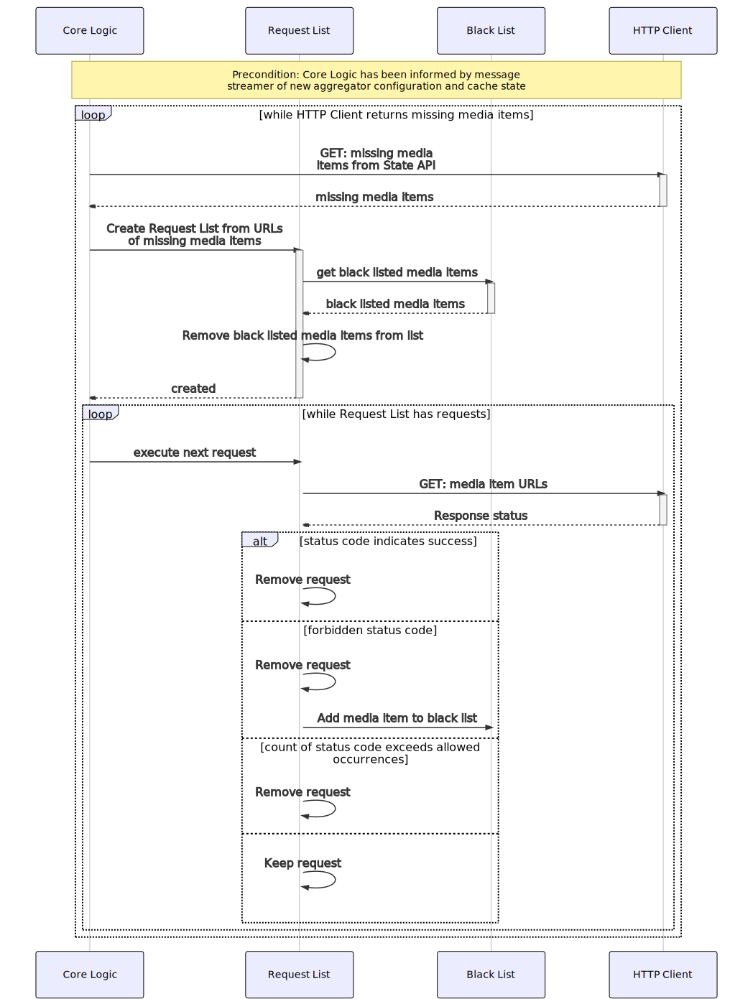

| [](https://www.5g-victori-project.eu/) | This project has received funding from the European Union’s Horizon 2020 research and innovation programme under grant agreement No 857201. The European Commission assumes no responsibility for any content of this repository. | [](https://ec.europa.eu/programmes/horizon2020/en) |
| ---------------------------------------------------------------------------------------- | ------------------------------------------------------------------------------------------------------------------------------------------- | ----------------------------------------------------------------------------------------------------------------------------------------------------------------------------------------------------------------------------------------- |


# Prefetcher

Requests content from a caching server in order to make the caching server cache the requested content.

## What is this?

The Prefetcher service is part of the [platform](../../../5gv-platform) for media caching on trains. The Prefetcher requests from the Online [Cache](../../../5gv-cache) content which is reported to be missing in the Online Cache. As the Online Cache operates in reverse proxy mode, it will cache the requested content. Subsequent request to the content will be responded to with the cached content. Missing state is reported by the [Cache Monitor](h../../../5gv-cache-monitor) to the [State API](../../../5gv-state-api) from where the Prefetcher retrieves a list of the missing videos.

## How does it work?

The below diagram illustrates the main software modules of the Prefetcher. The core logic module controls the service processes. atVia the [Message Streamer Client](../../../5gv-messenger) it sets listeners for messages that inform of new cache states as well as of new configurations of the [Aggregator](../../../5gv-aggregator).


When the core logic module receives the message that a new cache state has been initialised, it loads information about the missing media items from the [State API](../../../5gv-state-api) via the HTTP Client. From the media items' resource locations, the core logic module creates a Request List (implemented in `request-map.ts`). The Request List module sends requests via the HTTP Client module. For received responses it evaluates the HTTP status codes. It counts how often a certain status code has occurred for a certain request. If a limit value is exceeded, the request is deleted from the list. Limit values can be configured in a rule set. For example, it is useful to configure that `404` should only occur once, because it is unlikely that the resource will suddenly be available at the corresponding address on the next request. For a `500` status code, however, it can be useful to allow multiple attempts. Requests with a response status that indicates success are also deleted from the Request List. If the Request List is empty, the Core Logic module again queries the missing media items from the State API. This is necessary because even if all requests of the prefetcher were answered with success indicating status codes like `200`, corresponding media items still might be missing in the cache, for example because the download failed or because the media item was overwritten by a more recent entry in the cache. With the received media items, the core logic module instantiates a new Request List. The below figure shows this process as a sequence diagram.



If the core logic module receives a message that a new aggregator configuration is present, the fetch cycle described above is interrupted. Only when the notification about the newly initiated cache state is sent, a new fetch cycle starts.

## Install, build, run

**Note:** _Typically you would use the `up.sh` script from the [Platform](../../../5gv-platform) project to install, build and run this service as part of a composite of docker services. Read on if you intend to run the service directly on your host system._

**Prerequestits**: Following software needs to be installed on your host machine in order to execute the subsequent steps.

- [Node.js](https://nodejs.org/en/)
- [NPM](https://www.npmjs.com/)

First, `git clone` this project and change into its root directory. Than run the following command to install its dependencies:

```bash
$ npm install
```

You can than run the service in three different modes.

```bash
# development
$ npm run start

# watch mode
$ npm run start:dev

# production mode
$ npm run start:prod
```

With following command you can build a [docker image](https://www.docker.com) for this service. But again, typically you use the startup script `up.sh` of the [Platform](../../../5gv-platform) project to do the job.

```bash
$ DOCKER_BUILDKIT=1 docker build --ssh gitlab="$HOME/.ssh/<<your_private_key_name>>" -t prefetcher .
```

Replace `<<your_private_key_name>>` by the name of the private key used to authenticate at the repository.

## Modify the sequence diagram

The [sequence diagram](doc/diagrams/fetch-cycle.mmd) in this Doc has been build with [mermaid.js](https://mermaid-js.github.io/mermaid/) and its description language for [sequence diagrams](https://mermaid-js.github.io/mermaid/diagrams-and-syntax-and-examples/sequenceDiagram.html). To modify the diagram you need to install the npm depencies and render the diagram with the [mermaid cli tool](https://github.com/mermaid-js/mermaid-cli) `mmdc`, which will be installed as a local npm dev dependency and can be run with `npx`:

```bash
$ npm install
$ npx mmdc -i doc/diagrams/fetch-cycle.mmd -o doc/images/fetch-cycle.svg
```
